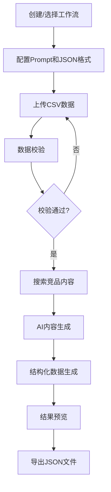
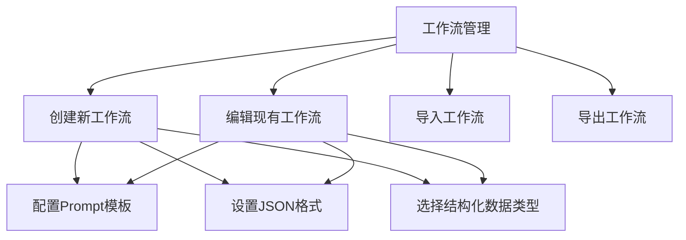
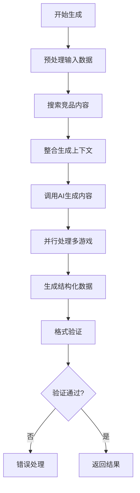

# 游戏网站SEO内容自动生成工具 产品设计文档

## 一、产品概述

### 1.1 产品定位
本工具面向游戏网站运营者，自动生成高质量、结构化、SEO友好的游戏详情页内容，满足内容填充、关键词命中、结构化数据等多重需求。支持多站点、多内容规范的灵活配置，极大提升内容生产效率。

### 1.2 核心价值
- **提升效率**：批量生成游戏详情页内容，减少人工编写时间
- **SEO优化**：自动生成符合谷歌标准的结构化数据
- **内容质量**：结合竞品分析和AI生成，确保内容质量和独特性
- **灵活配置**：支持多工作流，适应不同网站的内容需求

---

## 二、功能模块设计

### 2.1 工作流管理模块

#### 2.1.1 核心功能
- **创建工作流**：用户可以创建多个工作流，每个工作流对应一个网站/内容规范
- **编辑工作流**：支持修改工作流名称、Prompt模板、games.json格式
- **导入/导出工作流**：支持工作流配置的备份和分享
- **切换工作流**：快速切换不同的工作流进行内容生成

#### 2.1.2 工作流配置项
- **工作流名称**：用于标识和文件命名
- **内容生成Prompt模板**：自定义AI生成内容的提示词
- **games.json参考格式**：定义输出JSON的字段和结构
- **结构化数据选择**：可选择生成的结构化数据类型（game对象、视频对象、用户评价对象、面包屑对象、FAQ对象）
- **内容长度控制**：设置生成内容的字数范围和模块分配
- **关键词密度配置**：控制主关键词和长尾关键词的出现密度
- **内容生成模式**：选择AI生成的自由度（严格/标准/自由）
- **内容质量参数**：设置可读性、专业度、目标受众等要求

#### 2.1.3 数据结构
```json
{
  "workflowId": "uuid",
  "name": "工作流名称",
  "promptTemplate": "自定义Prompt模板",
  "gamesJsonFormat": "参考的games.json格式",
  "structuredDataTypes": ["game", "video", "review", "breadcrumb", "faq"],
  "contentSettings": {
    "wordCount": {
      "total": { "min": 800, "max": 1200 },
      "modules": {
        "description": { "min": 200, "max": 300 },
        "gameplay": { "min": 150, "max": 250 },
        "features": { "min": 100, "max": 200 },
        "reviews": { "min": 150, "max": 200 },
        "videoDescription": { "min": 100, "max": 150 }
      }
    },
    "keywordDensity": {
      "mainKeyword": { "target": 2.5, "max": 3.5 },
      "longTailKeywords": { "target": 1.5, "max": 2.5 },
      "naturalDistribution": true
    },
    "generationMode": "standard", // strict | standard | free
    "qualityParams": {
      "readabilityLevel": "intermediate", // beginner | intermediate | advanced
      "professionalTone": true,
      "targetAudience": "gamers", // gamers | general | children
      "creativeFreedom": true
    }
  },
  "createdAt": "2025-01-XX",
  "updatedAt": "2025-01-XX"
}
```

### 2.2 数据输入模块

#### 2.2.1 CSV上传功能
- **字段标准**：支持标准CSV格式上传
- **数据校验**：自动校验必填字段和格式
- **预览功能**：上传后支持数据预览和编辑

#### 2.2.2 CSV字段定义
```csv
gameName,mainKeyword,longTailKeywords,videoLink,internalLinks,competitorPages,iconUrl,realUrl
```

| 字段名 | 类型 | 是否必填 | 说明 |
|--------|------|----------|------|
| gameName | String | 是 | 游戏名称 |
| mainKeyword | String | 是 | 主关键词 |
| longTailKeywords | String | 否 | 长尾关键词，逗号分隔 |
| videoLink | String | 否 | 视频链接（YouTube等） |
| internalLinks | String | 否 | 站内内链，逗号分隔 |
| competitorPages | String | 否 | 竞品页面，逗号分隔 |
| iconUrl | String | 否 | 游戏图标地址 |
| realUrl | String | 是 | 游戏iframe地址 |

#### 2.2.3 CSV样例
```csv
gameName,mainKeyword,longTailKeywords,videoLink,internalLinks,competitorPages,iconUrl,realUrl
Aventador Vice Crime City,car games unblocked,"unblocked car games,games to play in the car,unblocked games",https://www.youtube.com/watch?v=BCQW3bCzrSU,"https://funlith.com/tag/free-online-car-games,https://funlith.com/games/car-simulator-3d,https://funlith.com/games/formula-x-speed-3d,https://funlith.com/games/sky-rider|Sky Rider","https://www.twoplayergames.org/game/aventador-vice-crime-city,https://gamedistribution.com/games/aventador-vice-crime-city/",https://img.gamedistribution.com/be4f7b9d1f3c4370a27cd86ba14fe15e-512x384.jpg,https://html5.gamedistribution.com/be4f7b9d1f3c4370a27cd86ba14fe15e
```

### 2.3 竞品内容采集模块

#### 2.3.1 Sitemap采集功能
- **网站源维护**：维护主要游戏网站的sitemap.xml列表
- **自动更新机制**：定期抓取并解析sitemap.xml，保持竞品数据库最新
- **游戏匹配算法**：基于游戏名称的智能匹配算法，支持模糊匹配和同义词识别
- **本地缓存管理**：本地存储竞品游戏索引，提升匹配速度

#### 2.3.2 支持的竞品网站
- **CoolMathGames**：https://www.coolmathgames.com/sitemap.xml
- **GameDistribution**：https://gamedistribution.com/sitemap-games-1.xml  
- **TwoPlayerGames**：https://www.twoplayergames.org/sitemap-games.xml

#### 2.3.3 匹配和抓取流程
1. **Sitemap解析**：定期抓取各网站sitemap.xml，提取游戏页面URL
2. **游戏名称匹配**：对用户提供的游戏名称进行智能匹配
3. **相似度评分**：使用字符串相似度算法计算匹配度
4. **页面内容抓取**：访问匹配度高的页面，抓取游戏内容
5. **数量限制**：每个游戏最多抓取2个高匹配度的页面

#### 2.3.4 本地竞品数据库
```typescript
interface CompetitorGame {
  id: string;
  gameName: string;
  gameSlug: string;
  gameUrl: string;
  sourceWebsite: string;
  sitemapUrl: string;
  lastUpdated: Date;
  matchingScore?: number;
}

interface CompetitorContent {
  gameId: string;
  sourceUrl: string;
  sourceWebsite: string;
  title: string;
  description: string;
  gameplayInstructions?: string;
  features?: string[];
  tags?: string[];
  category?: string;
  extractedAt: Date;
}
```

#### 2.3.5 匹配算法策略
- **精确匹配**：游戏名称完全相同（匹配度：100%）
- **模糊匹配**：忽略大小写、特殊字符、空格（匹配度：90%+）
- **关键词匹配**：提取核心关键词进行匹配（匹配度：70%+）
- **同义词匹配**：支持常见游戏类型同义词（匹配度：60%+）

#### 2.3.6 抓取内容范围
- 游戏名称和描述
- 游戏玩法说明
- 游戏特色和亮点
- 游戏分类和标签
- 用户评价片段（如有）
- 相关游戏推荐

#### 2.3.7 错误处理机制
- **无匹配游戏**：提示"未找到竞品内容，将使用基础模板生成"
- **网络异常**：自动重试机制，最多重试3次
- **解析错误**：记录错误日志，跳过有问题的页面
- **内容为空**：标记为无效内容，不参与生成过程

### 2.4 AI内容生成模块

#### 2.4.1 生成流程
1. **输入预处理**：清理和优化games.json格式，控制Prompt长度
2. **内容参数配置**：应用字数控制、关键词密度等设置
3. **竞品内容整合**：将采集的竞品内容整合到生成上下文
4. **智能Prompt构建**：根据生成模式和质量参数构建Prompt
5. **并行生成**：支持多游戏并行处理，提升生成效率
6. **内容校验**：验证生成内容的格式、字数、关键词密度等
7. **质量评估**：评估内容质量并提供优化建议

#### 2.4.2 Prompt优化策略
- **字段名保留**：完整保留games.json的字段名
- **值格式简化**：数组值简化为`["s","b"]`格式，保留类型信息
- **长度控制**：自动控制Prompt总长度，优先保证核心信息
- **参数集成**：将字数要求、关键词密度、生成模式等参数融入Prompt
- **动态调整**：根据内容生成模式动态调整Prompt策略

#### 2.4.3 生成内容模块
- **游戏简介** (200-300词)：包含主关键词，介绍游戏核心玩法
- **玩法操作** (150-250词)：详细说明游戏操作方式和规则
- **游戏特色** (100-200词)：突出游戏独特功能和亮点
- **玩家真实好评** (150-200词)：模拟真实用户评价和反馈
- **视频内容描述** (100-150词)：如有视频链接，生成视频内容描述

#### 2.4.4 内容生成模式详解
- **严格模式 (Strict)**：
  - 严格按照设定的字数范围生成
  - 精确控制关键词密度
  - 只生成必要的内容模块
  - 适合有明确内容规范的网站

- **标准模式 (Standard)**：
  - 在字数范围内适度灵活
  - 自然融入关键词，保持可读性
  - 可适当增加相关信息丰富内容
  - 平衡SEO效果和用户体验

- **自由模式 (Free)**：
  - AI可自由发挥，增加创意内容
  - 自然的关键词分布，避免过度优化
  - 可增加游戏技巧、背景故事等额外内容
  - 注重内容质量和用户吸引力

#### 2.4.5 关键词密度控制机制
- **密度计算**：实时计算关键词出现频率
- **自然分布**：确保关键词在各段落中自然分布
- **同义词替换**：使用同义词避免关键词堆砌
- **语义相关**：融入语义相关的词汇增强相关性
- **质量监控**：监控内容可读性，避免过度优化

### 2.5 结构化数据生成模块

#### 2.5.1 支持的结构化数据类型
- **VideoGame对象**：游戏基本信息
- **VideoObject对象**：视频相关信息
- **Review对象**：用户评价
- **BreadcrumbList对象**：面包屑导航
- **FAQPage对象**：常见问题

#### 2.5.2 结构化数据标准
严格遵循schema.org标准和谷歌SEO最佳实践，参考template.md中的格式。

#### 2.5.3 示例结构化数据
```json
{
  "@context": "https://schema.org",
  "@type": "VideoGame",
  "name": "游戏名称",
  "description": "游戏描述",
  "url": "游戏链接",
  "image": "游戏图标",
  "applicationCategory": "GameApplication",
  "genre": ["类型1", "类型2"],
  "aggregateRating": {
    "@type": "AggregateRating",
    "ratingValue": "4.5",
    "reviewCount": "100"
  }
}
```

### 2.6 结果预览与导出模块

#### 2.6.1 预览功能
- **实时预览**：生成过程中实时显示结果
- **格式化显示**：支持JSON格式化显示
- **内容编辑**：支持对生成结果进行微调

#### 2.6.2 导出功能
- **JSON格式导出**：支持标准JSON格式下载
- **文件命名规则**：`{工作流名称}_{YYYYMMDD}_{HHMMSS}.json`
- **批量导出**：支持多游戏结果的批量导出

#### 2.6.3 错误处理
- **生成失败**：显示具体错误信息和重试选项
- **字段缺失**：标记缺失字段，提供补充建议
- **格式错误**：自动校验并提示格式问题

---

## 三、用户界面设计

### 3.1 设计理念与原则

#### 3.1.1 设计理念
- **专业性**：面向专业用户，界面简洁而功能完善
- **一致性**：统一的视觉语言和交互模式
- **易用性**：清晰的信息层级和直观的操作流程
- **高效性**：减少操作步骤，提升工作效率

#### 3.1.2 设计原则
- **清晰的视觉层级**：重要信息突出显示，次要信息适当弱化
- **一致的交互模式**：相同类型的操作使用统一的交互方式
- **及时的状态反馈**：操作结果即时可见，进度状态清晰
- **容错性设计**：防止误操作，提供撤销和确认机制

### 3.2 视觉设计规范

#### 3.2.1 色彩系统
```css
/* 主色调 - 专业蓝 */
--primary-50: #eff6ff;
--primary-100: #dbeafe;
--primary-500: #3b82f6;
--primary-600: #2563eb;
--primary-700: #1d4ed8;

/* 辅助色 - 功能色 */
--success: #10b981;    /* 成功状态 */
--warning: #f59e0b;    /* 警告状态 */
--error: #ef4444;      /* 错误状态 */
--info: #06b6d4;       /* 信息提示 */

/* 中性色 - 文本和背景 */
--gray-50: #f9fafb;    /* 浅背景 */
--gray-100: #f3f4f6;   /* 分割线 */
--gray-400: #9ca3af;   /* 次要文本 */
--gray-600: #4b5563;   /* 主要文本 */
--gray-900: #111827;   /* 标题文本 */
```

#### 3.2.2 字体系统
```css
/* 字体族 */
--font-family: -apple-system, BlinkMacSystemFont, 'Segoe UI', Roboto, 'Helvetica Neue', Arial, sans-serif;

/* 字体大小 */
--text-xs: 0.75rem;    /* 12px - 辅助信息 */
--text-sm: 0.875rem;   /* 14px - 正文 */
--text-base: 1rem;     /* 16px - 标准文本 */
--text-lg: 1.125rem;   /* 18px - 副标题 */
--text-xl: 1.25rem;    /* 20px - 小标题 */
--text-2xl: 1.5rem;    /* 24px - 主标题 */

/* 字重 */
--font-normal: 400;
--font-medium: 500;
--font-semibold: 600;
--font-bold: 700;
```

#### 3.2.3 间距系统
```css
/* 间距规范 - 8px基准 */
--spacing-1: 0.25rem;  /* 4px */
--spacing-2: 0.5rem;   /* 8px */
--spacing-3: 0.75rem;  /* 12px */
--spacing-4: 1rem;     /* 16px */
--spacing-5: 1.25rem;  /* 20px */
--spacing-6: 1.5rem;   /* 24px */
--spacing-8: 2rem;     /* 32px */
--spacing-12: 3rem;    /* 48px */
```

#### 3.2.4 阴影系统
```css
/* 阴影层级 */
--shadow-sm: 0 1px 2px 0 rgb(0 0 0 / 0.05);
--shadow: 0 1px 3px 0 rgb(0 0 0 / 0.1), 0 1px 2px -1px rgb(0 0 0 / 0.1);
--shadow-md: 0 4px 6px -1px rgb(0 0 0 / 0.1), 0 2px 4px -2px rgb(0 0 0 / 0.1);
--shadow-lg: 0 10px 15px -3px rgb(0 0 0 / 0.1), 0 4px 6px -4px rgb(0 0 0 / 0.1);
```

### 3.3 组件设计规范

#### 3.3.1 按钮组件
```typescript
// 按钮类型
type ButtonVariant = 'primary' | 'secondary' | 'outline' | 'ghost' | 'danger';
type ButtonSize = 'sm' | 'md' | 'lg';

// 设计规范
- Primary: 主要操作，每个区域最多一个
- Secondary: 次要操作，使用频率较高
- Outline: 辅助操作，不抢夺视觉焦点
- Ghost: 最轻量操作，如取消、关闭
- Danger: 危险操作，如删除
```

#### 3.3.2 表单组件
```typescript
// 表单元素规范
- 标签：必填项使用红色星号标记
- 输入框：统一圆角4px，边框1px
- 错误状态：红色边框 + 错误信息
- 成功状态：绿色边框 + 成功图标
- 禁用状态：灰色背景 + 禁用鼠标
```

#### 3.3.3 数据展示组件
```typescript
// 表格规范
- 表头：加粗字体，灰色背景
- 行高：48px最小高度
- 分割线：1px灰色边框
- 悬停效果：浅灰色背景
- 选中状态：蓝色背景

// 卡片规范
- 圆角：8px
- 阴影：shadow-sm
- 内边距：24px
- 背景：白色
```

### 3.4 主界面布局

#### 3.4.1 整体布局结构
```
┌─────────────────────────────────────────────────────────┐
│                    顶部导航栏 (64px)                      │
├─────────────┬───────────────────────────────────────────┤
│             │                                           │
│   侧边栏    │              主内容区                      │
│  (240px)    │           (自适应宽度)                     │
│             │                                           │
│             │                                           │
├─────────────┴───────────────────────────────────────────┤
│                  底部状态栏 (40px)                        │
└─────────────────────────────────────────────────────────┘
```

#### 3.4.2 响应式断点
```css
/* 断点定义 */
--breakpoint-sm: 640px;   /* 平板竖屏 */
--breakpoint-md: 768px;   /* 平板横屏 */
--breakpoint-lg: 1024px;  /* 笔记本 */
--breakpoint-xl: 1280px;  /* 桌面 */

/* 响应式行为 */
- < 768px: 侧边栏收起，主内容全屏
- >= 768px: 侧边栏固定显示
- >= 1280px: 内容居中，最大宽度限制
```

### 3.5 具体页面设计

#### 3.5.1 顶部导航栏
```typescript
interface HeaderProps {
  // 布局：固定高度64px，白色背景，底部阴影
  // 内容：左侧Logo + 中间工作流选择器 + 右侧用户操作
  logo: string;           // 产品Logo
  currentWorkflow: string; // 当前选中工作流
  workflows: Workflow[];   // 工作流列表
  onWorkflowChange: (id: string) => void;
}

// 设计要点：
- Logo区域：160px宽度，品牌标识
- 工作流选择器：下拉菜单，显示当前工作流
- 用户操作区：设置、帮助、主题切换
- 分割线：底部1px灰色边框
```

#### 3.5.2 侧边栏导航
```typescript
interface SidebarProps {
  // 布局：固定宽度240px，浅灰背景，右侧分割线
  // 内容：导航菜单 + 快速操作区
  activeRoute: string;     // 当前激活路由
  onNavigate: (route: string) => void;
}

// 导航菜单项：
- 工作流管理：设置图标
- 数据上传：上传图标  
- 内容生成：魔法棒图标
- 结果查看：文档图标

// 设计要点：
- 菜单项：高度48px，圆角4px悬停效果
- 激活状态：蓝色背景，白色文字
- 图标：16x16px，与文字左对齐
- 分组：用细分割线区分不同功能区
```

#### 3.5.3 工作流管理界面
```typescript
interface WorkflowPageProps {
  // 布局：标题区 + 工具栏 + 内容区
  // 功能：列表展示 + 搜索筛选 + 操作按钮
}

// 页面结构：
┌─────────────────────────────────────────────┐
│  📋 工作流管理                    [+ 新建工作流] │
├─────────────────────────────────────────────┤
│  🔍 [搜索框]  [筛选] [导入] [批量操作]           │
├─────────────────────────────────────────────┤
│  ┌─────────────────────────────────────────┐ │
│  │  工作流卡片列表                           │ │
│  │  - 工作流名称 + 描述                     │ │
│  │  - 内容设置：字数800-1200，密度2.5%      │ │
│  │  - 生成模式：标准模式                     │ │
│  │  - 创建时间 + 最后修改                   │ │
│  │  - 操作按钮：编辑/复制/导出/删除          │ │
│  └─────────────────────────────────────────┘ │
└─────────────────────────────────────────────┘

// 设计要点：
- 标题：24px加粗，左对齐
- 工具栏：按钮统一高度40px，间距16px
- 卡片：圆角8px，阴影效果，悬停提升
- 操作按钮：图标+文字，下拉菜单形式
- 内容设置预览：小标签形式显示关键配置
```

#### 3.5.4 数据上传界面
```typescript
interface UploadPageProps {
  // 布局：上传区 + 预览区 + 操作区
  // 功能：文件上传 + 数据预览 + 验证提示
}

// 页面结构：
┌─────────────────────────────────────────────┐
│  📤 数据上传                                  │
├─────────────────────────────────────────────┤
│  ┌─────────────────────────────────────────┐ │
│  │       拖拽上传区域                       │ │
│  │    📁 拖拽CSV文件到此处                   │ │
│  │       或点击选择文件                     │ │
│  └─────────────────────────────────────────┘ │
├─────────────────────────────────────────────┤
│  ✅ 验证结果：23条记录，2个错误                │
├─────────────────────────────────────────────┤
│  📊 数据预览表格 (可编辑)                     │
└─────────────────────────────────────────────┘

// 设计要点：
- 上传区：虚线边框，居中布局，悬停效果
- 状态提示：彩色图标+状态文字
- 预览表格：固定表头，虚拟滚动，内联编辑
- 错误标记：红色边框，悬停显示错误信息
```

#### 3.5.5 内容生成界面
```typescript
interface GeneratePageProps {
  // 布局：配置区 + 进度区 + 预览区
  // 功能：参数设置 + 实时进度 + 结果展示
}

// 页面结构：
┌─────────────────────────────────────────────┐
│  ⚡ 内容生成                                  │
├─────────────────────────────────────────────┤
│  工作流：[下拉选择] 数据：✅ 23条游戏          │
│  字数设置：800-1200词 | 关键词密度：2.5%     │
│  生成模式：标准模式 ⓘ                        │
│  结构化数据：☑️游戏 ☑️视频 ☐评价             │
│  [开始生成] [暂停] [停止] [高级设置]          │
├─────────────────────────────────────────────┤
│  📊 生成进度：15/23 (65%)                    │
│  ████████████░░░░░░                          │
│  当前：生成"Aventador Vice Crime City"        │
│  字数：923词 | 主关键词密度：2.3% ✅          │
├─────────────────────────────────────────────┤
│  📋 生成结果预览 (实时更新)                   │
│  - JSON格式化显示 + 内容质量评分             │
│  - 语法高亮 + 关键词密度可视化               │
│  - 折叠展开 + 字数统计                       │
└─────────────────────────────────────────────┘

// 设计要点：
- 配置区：表单布局，标签清晰，提示图标
- 进度条：蓝色填充，百分比显示
- 状态文字：实时更新，动画效果，质量指标
- 预览区：代码编辑器样式，只读模式，质量评估
- 高级设置：模态框形式，详细参数配置
```

#### 3.5.6 结果查看界面
```typescript
interface ResultPageProps {
  // 布局：筛选区 + 列表区 + 详情区
  // 功能：历史记录 + 搜索筛选 + 详细查看
}

// 页面结构：
┌─────────────────────────────────────────────┐
│  📄 生成结果                      [批量导出]   │
├─────────────────────────────────────────────┤
│  🔍 [搜索] [日期筛选] [工作流筛选] [状态筛选]   │
├─────────────────────────────────────────────┤
│  结果列表                        │  详情预览   │
│  ┌─────────────────────────────┐ │ ┌─────────┐ │
│  │ 📋 工作流A_20250115_143022   │ │ │ JSON    │ │
│  │ 🕐 2025-01-15 14:30         │ │ │ 格式化   │ │
│  │ ✅ 成功 23/23                │ │ │ 显示    │ │
│  │ [查看] [导出] [删除]         │ │ │         │ │
│  └─────────────────────────────┘ │ └─────────┘ │
└─────────────────────────────────────────────┘

// 设计要点：
- 列表项：卡片样式，悬停效果
- 状态标识：彩色图标+状态文字
- 操作按钮：图标按钮，工具提示
- 详情区：代码编辑器，语法高亮
```

### 3.6 交互设计规范

#### 3.6.1 微交互设计
```typescript
// 悬停效果
- 按钮：背景色变深，0.15s过渡
- 卡片：阴影加深，向上位移2px
- 链接：颜色变深，下划线显示

// 点击反馈
- 按钮：按下状态，背景色更深
- 卡片：轻微按下效果
- 开关：滑动动画，0.2s缓动

// 加载状态
- 按钮：禁用+加载图标+文字变更
- 数据：骨架屏占位
- 页面：顶部进度条
```

#### 3.6.2 反馈机制
```typescript
// 成功反馈
- Toast提示：绿色背景，成功图标
- 内联提示：字段旁边绿色对勾
- 状态变更：实时更新UI状态

// 错误反馈
- Toast提示：红色背景，错误图标
- 表单验证：红色边框+错误信息
- 页面错误：错误页面+重试按钮

// 进度反馈
- 进度条：实时更新百分比
- 状态文字：当前操作描述
- 步骤指示：高亮当前步骤
```

### 3.7 无障碍设计

#### 3.7.1 键盘导航
```typescript
// 焦点管理
- Tab顺序：逻辑顺序，跳过隐藏元素
- 焦点指示：明显的焦点边框
- 快捷键：常用操作支持快捷键

// 键盘交互
- Enter：确认操作
- Escape：取消/关闭
- 方向键：列表/表格导航
- Space：选择/切换
```

#### 3.7.2 语义化标记
```html
<!-- 使用正确的HTML标签 -->
<main role="main">           <!-- 主内容区 -->
<nav role="navigation">      <!-- 导航区域 -->
<section aria-label="工作流管理"> <!-- 功能区域 -->
<button aria-pressed="true"> <!-- 状态按钮 -->
<input aria-required="true"> <!-- 必填字段 -->
```

### 3.8 响应式设计

#### 3.8.1 移动端适配
```css
/* 移动端布局调整 */
@media (max-width: 768px) {
  /* 侧边栏：抽屉式，覆盖主内容 */
  .sidebar { transform: translateX(-100%); }
  
  /* 表格：横向滚动 */
  .table-container { overflow-x: auto; }
  
  /* 按钮：增大触摸区域 */
  .button { min-height: 44px; }
  
  /* 字体：相对放大 */
  .text-base { font-size: 1.125rem; }
}
```

#### 3.8.2 平板端优化
```css
/* 平板端布局 */
@media (min-width: 768px) and (max-width: 1024px) {
  /* 侧边栏：可收起，图标模式 */
  .sidebar.collapsed { width: 60px; }
  
  /* 内容：适应屏幕宽度 */
  .main-content { padding: 20px; }
  
  /* 卡片：2列布局 */
  .card-grid { grid-template-columns: repeat(2, 1fr); }
}
```

---

## 四、技术架构

### 4.1 技术选型
- **前端框架**：React + Next.js 14
- **UI组件库**：Tailwind CSS + Headless UI
- **状态管理**：Zustand
- **数据请求**：SWR
- **文件处理**：Papa Parse (CSV解析)
- **AI模型**：DeepSeek V3 API
- **部署平台**：Vercel

### 4.2 系统架构
```
┌─────────────────┐    ┌─────────────────┐    ┌─────────────────┐
│   前端界面      │    │   API路由       │    │   外部服务      │
│   (Next.js)     │◄──►│  (Next.js API)  │◄──►│  (DeepSeek API) │
│                 │    │                 │    │  (搜索引擎API)  │
└─────────────────┘    └─────────────────┘    └─────────────────┘
         │                       │                       │
         ▼                       ▼                       ▼
┌─────────────────┐    ┌─────────────────┐    ┌─────────────────┐
│   本地存储      │    │   文件系统      │    │   竞品内容库    │
│  (LocalStorage) │    │  (Vercel存储)   │    │  (临时缓存)     │
└─────────────────┘    └─────────────────┘    └─────────────────┘
```

### 4.3 数据流设计
1. **用户操作** → 前端界面
2. **数据处理** → API路由处理
3. **AI调用** → DeepSeek API
4. **结果返回** → 前端显示
5. **数据存储** → 本地/云存储

### 4.4 API设计
```typescript
// 工作流相关
POST /api/workflows - 创建工作流
GET /api/workflows - 获取工作流列表
PUT /api/workflows/:id - 更新工作流
DELETE /api/workflows/:id - 删除工作流
POST /api/workflows/import - 导入工作流
GET /api/workflows/:id/export - 导出工作流

// 内容生成相关
POST /api/generate - 生成内容
GET /api/generate/:id - 获取生成结果
POST /api/upload/csv - 上传CSV文件

// 竞品内容相关
POST /api/competitors/search - 搜索竞品内容
GET /api/competitors/:gameId - 获取竞品内容
```

---

## 五、数据模型

### 5.1 工作流模型
```typescript
interface Workflow {
  id: string;
  name: string;
  promptTemplate: string;
  gamesJsonFormat: string;
  structuredDataTypes: StructuredDataType[];
  createdAt: Date;
  updatedAt: Date;
}

type StructuredDataType = 'game' | 'video' | 'review' | 'breadcrumb' | 'faq';
```

### 5.2 游戏数据模型
```typescript
interface GameData {
  gameName: string;
  mainKeyword: string;
  longTailKeywords?: string;
  videoLink?: string;
  internalLinks?: string;
  competitorPages?: string;
  iconUrl?: string;
  realUrl: string;
}
```

### 5.3 生成结果模型
```typescript
interface GenerationResult {
  id: string;
  workflowId: string;
  workflowName: string;
  gameData: GameData[];
  generatedContent: any[];
  structuredData?: any[];
  status: 'pending' | 'success' | 'error';
  errorMessage?: string;
  createdAt: Date;
}
```

---

## 六、业务流程

### 6.1 完整业务流程


### 6.2 工作流管理流程


### 6.3 内容生成流程


---

## 七、质量保证

### 7.1 数据验证
- **CSV格式验证**：字段完整性、数据类型验证
- **URL有效性验证**：检查视频链接、图标链接等
- **内容长度限制**：避免超长内容影响性能

### 7.2 错误处理
- **网络错误**：API调用失败的重试机制
- **生成错误**：AI生成失败的错误提示和重试
- **格式错误**：JSON格式错误的自动修复

### 7.3 性能优化
- **并行处理**：多游戏同时生成，提升效率
- **缓存机制**：竞品内容缓存，减少重复抓取
- **懒加载**：大量数据的分页加载

---

## 八、安全考虑

### 8.1 数据安全
- **本地存储**：敏感配置本地存储，不上传服务器
- **API密钥保护**：DeepSeek API密钥安全存储
- **数据清理**：定期清理临时文件和缓存

### 8.2 内容合规
- **版权风险**：竞品内容仅作参考，生成原创内容
- **内容过滤**：避免生成不当或违规内容
- **用户协议**：明确工具使用范围和责任

---

## 九、部署方案

### 9.1 Vercel部署配置
```json
{
  "name": "seo-content-generator",
  "version": 2,
  "builds": [
    {
      "src": "package.json",
      "use": "@vercel/next"
    }
  ],
  "env": {
    "DEEPSEEK_API_KEY": "@deepseek-api-key"
  }
}
```

### 9.2 环境变量配置
```env
DEEPSEEK_API_KEY=your_deepseek_api_key
SEARCH_API_KEY=your_search_api_key
NEXT_PUBLIC_APP_URL=https://your-app.vercel.app
```

### 9.3 构建优化
- **代码分割**：按路由分割代码，提升加载速度
- **静态优化**：静态资源CDN加速
- **压缩优化**：Gzip压缩和资源压缩

---

## 十、后续迭代计划

### 10.1 V1.0 核心功能
- ✅ 工作流管理
- ✅ CSV数据上传
- ✅ AI内容生成
- ✅ 结构化数据生成
- ✅ 结果预览和导出

### 10.2 V1.1 功能增强
- 🔄 多语言内容生成支持
- 🔄 自定义结构化数据模板
- 🔄 竞品内容采集深度配置
- 🔄 批量处理进度优化

### 10.3 V1.2 高级功能
- 🔄 内容质量评分
- 🔄 SEO效果分析
- 🔄 A/B测试支持
- 🔄 团队协作功能

---

## 十一、文档说明

本文档为游戏网站SEO内容自动生成工具的完整产品设计文档，涵盖了产品定位、功能设计、技术架构、业务流程等核心内容。

### 文档维护
- **版本**：V1.0
- **更新日期**：2025-01-XX
- **维护者**：产品团队
- **审核者**：技术团队

### 相关文档
- `template.md` - 结构化数据模板
- `README.md` - 项目说明文档
- `API文档` - 接口设计文档 